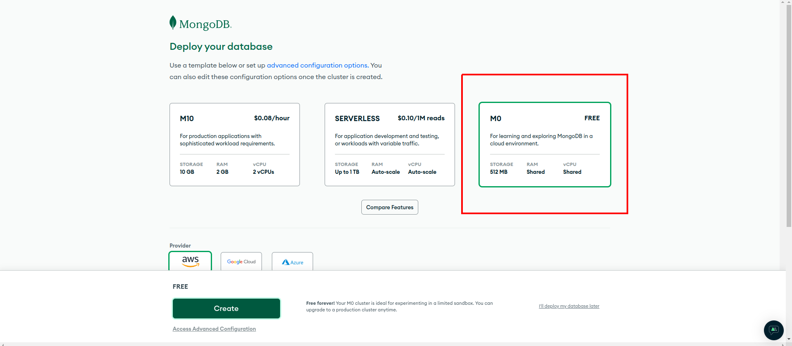

# Code Inbox Server

<div align="center">

[](https://github.com/PyCQA/pylint)
[](https://github.com/psf/black)
[](http://mypy-lang.org/)
[](https://opensource.org/licenses/MIT)

</div>


A Fully Async-based backend for [Code Inbox](https://github.com/wiseaidev/code-inbox).

---

## Development Requirements

- Make (GNU command)
- Python (>= 3.9)
- Poetry (1.6)

---

## Project Structure

<details>
<summary><code>❯ tree src</code></summary>

```sh
├── nylas         # Package contains different config files for the `nylas` app.
│   ├── crud.py       # Module contains different CRUD operations performed on the database.
│   ├── models.py     # Module contains different data models for ODM to interact with database.
│   ├── router.py     # Module contains different routes for this api.
│   └── schemas.py    # Module contains different schemas for this api for validation purposes.
├── users         # Package contains different config files for the `users` app.
│   ├── crud.py       # Module contains different CRUD operations performed on the database.
│   ├── models.py     # Module contains different models for ODMs to inteact with database.
│   ├── router.py     # Module contains different routes for this api.
│   └── schemas.py    # Module contains different schemas for this api for validation purposes.
├── utils         # Package contains different common utility modules for the whole project.
│   ├── openai_api.py       # A utility script that creates an openai object.
│   ├── dependencies.py     # A utility script that yield a session for each request to make the crud call work.
│   ├── engine.py           # A utility script that initializes an ODMantic engine, client, nylas, and openai and set them as app state variables.
├── config.py     # Module contains the main configuration settings for project.
├── main.py       # Startup script. Starts uvicorn.
└── py.typed      # mypy related file.
```

</details>

---

## Installation with Make

The project is best configured, dependencies installed, and managed using the `make` utility. Therefore, it is essential to ensure that you have `make` properly installed and configured on your local machine before proceeding. Follow the steps below to install `make` on your specific operating system:

**For Windows:**

1. Visit the [Stack Overflow thread](https://stackoverflow.com/questions/32127524/how-to-install-and-use-make-in-windows) that provides detailed instructions on how to install and use `make` on Windows.

2. Follow the step-by-step guide to download and set up `make` for Windows. Once installed, ensure that the `make` executable is in your system's PATH for easy access.

**For Mac OS:**

1. Visit the [Stack Overflow thread](https://stackoverflow.com/questions/11494522/installing-make-on-mac) that explains the installation process for `make` on Mac OS.

2. Follow the instructions provided in the thread to install `make` on your Mac OS. You may use package managers like Homebrew or MacPorts to simplify the installation process.

**Using `make` for the Project**

With `make` installed and configured on your machine, you can now navigate to the root directory of this project and take advantage of the available `make` commands to manage and run the project efficiently. Here are some common `make` commands you can run:

```sh
Please use 'make <target>' where <target> is one of:

venv                     Create a virtual environment
install                  Install the package and all required core dependencies
run                      Running the app locally
deploy-deta              Deploy the app on a Deta Micro
clean                    Remove all build, test, coverage and Python artifacts
lint                     Check style with pre-commit
test                     Run tests quickly with pytest
test-all                 Run tests on every Python version with tox
build                    Build docker containers services
up                       Spin up the built containers
down                     Stop all running containers
coverage                 Check code coverage quickly with the default Python
```

By running these `make` commands, you can streamline various project-related tasks and ensure a smooth development and execution experience.

### 1. Create a virtualenv

```sh
make venv
```

### 2. Activate the virtualenv

```sh
source .venv/bin/activate
```

### 3. Install dependencies

```sh
make install
```

**Note**: _This command will automatically generate a `.env` file from `.env.example`, uninstall the old version of poetry on your machine, then install latest version `1.6.1`, and install the required main dependencies._

### 4. Setup a MongoDB Account and Configure Your Database

> **Note**<br>
The database is used to store additional user information beyond what is provided by the Nylas account object. This additional data may include items such as the user's profile picture, birth date, and other relevant details.

MongoDB is a popular NoSQL database that you can use to store and manage your data. To get started with MongoDB and set up your database, follow these steps:

#### 4.1 Create a MongoDB Account and Deploy a Cluster

1. **Sign Up for a MongoDB Account:** Go to the official MongoDB website at [https://account.mongodb.com/account/login](https://account.mongodb.com/account/login) to create a MongoDB account if you don't already have one. You may need to provide some basic information during the registration process.
   

1. **Create a New Deployment:**
   - After logging into your MongoDB account, navigate to the MongoDB Atlas dashboard.
   - Click on the "Create" button to initiate the creation of a new deployment.
   

1. **Select the Free Tier:** Choose the free tier option to get started without incurring any costs during the initial setup.
   

1. **Set Username and Password:** Set up a username and password that you'll use to connect to your remote MongoDB server. Click "Create User" to save these credentials.
   

1. **Configure IP Access List:** To connect to your MongoDB cluster from anywhere for development and simplicity purposes, set the IP access list to "0.0.0.0/0." This allows connections from any IP address. Later, in a production environment, you should restrict this access to specific IPs for security reasons. Click "Add Entry" to confirm your settings.
   

#### 4.2 Connect to the MongoDB Cluster

1. **Access the Database Section:** In the MongoDB Atlas dashboard, locate the left-side panel and click on the "Database" section.
   

1. **Connect to the Cluster:** Click the "Connect" button associated with your cluster to establish a connection.

1. **Copy the Cluster URL:** A connection dialog will appear with your cluster's connection details. Click the "Copy" button next to the Cluster URL. You'll need this URL to connect to your MongoDB cluster from your application.
   

#### 4.3 Set Your MongoDB Credentials

Now that you have your MongoDB cluster set up, you need to configure your project to use the MongoDB database. Follow these steps to set your MongoDB credentials:

1. **Update Your Environment Variables:** Open your project's configuration file or `.env` file, which stores environment variables.

1. **Set the MongoDB Credentials:**
   - Add the following environment variables to your configuration file, filling in the values accordingly:
     ```yaml
     # Database
     MONGODB_USERNAME=<Your_MongoDB_Username>
     MONGODB_PASSWORD=<Your_MongoDB_Password>
     MONGODB_HOST=<Your_MongoDB_Cluster_URL>
     MONGODB_DATABASE=coding
     ```
   - Replace `<Your_MongoDB_Username>`, `<Your_MongoDB_Password>`, and `<Your_MongoDB_Cluster_URL>` with the credentials and URL copied from your MongoDB cluster settings.

3. **Save Your Configuration:** Make sure to save the changes to your configuration file.

By setting these environment variables, your project will have the necessary credentials to connect to your MongoDB cluster and interact with your database. This configuration allows your application to store and retrieve data from MongoDB seamlessly.

> **Note**<br>
Keeping your MongoDB credentials secure is crucial to maintaining the security of your database. In a production environment, consider using more secure access controls and practices.

### 5. Create a Deta Account and Configure Data Storage

To utilize Deta for data storage and management, follow these steps:

1. **Sign up for a Deta Account:** Start by creating a Deta account if you don't already have one. You can sign up at [Deta's website](https://deta.space/).

1. **Create a Deta Space:** After logging into your Deta account, navigate to the Deta Space section. Here, you can organize your data collections and storage.
   

1. **Create a New Collection:** Inside your Deta Space, create a new collection. Collections are used to organize and store your data.
   

1. **Attach a Drive:** To store profile images or other files, you can attach a drive to your collection. In this case, name it `profile-images`. This drive will be used to manage and store profile images.
   
   

1. **Generate a Data Key:** To interact with your Deta collection programmatically, you'll need a data key. Create a new data key for your project, and make sure to copy it. You'll use this key in the next step.
   

#### 5.1 Set Your Deta Project Key

Now that you have your Deta project set up, you need to configure your project to use the Deta API. Follow these steps to set your Deta project key:

1. **Update Your Environment Variables:** Open your project's configuration file or `.env` file, which stores environment variables.

1. **Set the Deta Project Key:** Add the following environment variable to your configuration file, replacing `DETA_PROJECT_KEY` with the actual key you copied earlier:
     ```yaml
     # Deta
     DETA_PROJECT_KEY=<Your_Deta_Project_Key>
     ```
   - Make sure to save the changes to your configuration file.

By setting the `DETA_PROJECT_KEY` environment variable, your project will have the necessary access to interact with your Deta Space and perform actions like storing and retrieving data.

### 6. Create a Nylas Account and Configure the System Token

Nylas is a platform that enables email and scheduling functionality in your application. To get started with Nylas and configure the system token, follow these steps:

#### 6.1 Create a Nylas Account and Configure Nylas Client ID and Client Secret

1. **Visit the Nylas Website:** Go to the official Nylas website at [https://dashboard.nylas.com/sign-in](https://dashboard.nylas.com/sign-in) to create a Nylas account if you don't already have one.

1. **Registration Process:** Complete the registration process by filling in the necessary information.
   

1. **Connect an Account:** After successfully creating your Nylas account and logging in, go to the "Account" tab or section in the Nylas dashboard.
   

1. **Connect an Email Account:** Click on "Connect an Account" to integrate an email account with Nylas. Follow the on-screen instructions to connect the desired email account(s) that your application will interact with.

1. **Copy the Access Token:** Once you have successfully connected your email account(s), Nylas will provide an access token. Copy this access token as you will need it to configure your application.
   

To integrate Nylas into your application, you need to set up the Nylas Client ID and Client Secret in your project's settings.

1. **Access App Settings:** In the Nylas dashboard, navigate to the "App Settings" section. This is where you can manage your application's configuration.
   

#### 6.2 Set Your Nylas Client ID, Client Secret, and System Token

Now that you have your Nylas project set up, you need to set the Client ID, Client Secret, and System Token in your application:

1. **Set the Nylas Client ID, Client Secret, and System Token:** Open your project's configuration file or `.env` file, where you store environment variables.

1. **Add the Nylas Client ID , Client Secret, and System Token:** In your configuration file, add the following environment variables, replacing `<Your_Nylas_Client_ID>`, `<Your_Nylas_Client_Secret>`, and `<Your_Nylas_System_Token>` with the actual values you obtained from the Nylas dashboard:
     ```yaml
     # Nylas
     NYLAS_SYSTEM_TOKEN=<Your_Nylas_System_Token>
     NYLAS_CLIENT_ID=<Your_Nylas_Client_ID>
     NYLAS_CLIENT_SECRET=<Your_Nylas_Client_Secret>
     ```
     - Save the changes to your configuration file.

By setting the `NYLAS_CLIENT_ID`, `NYLAS_CLIENT_SECRET` and `NYLAS_SYSTEM_TOKEN` environment variables, your application will have the necessary credentials to authenticate and interact with the Nylas API for email and scheduling functionality. These credentials are essential for secure communication with Nylas services.

### 7. Create an OpenAI Account and Configure the API Key

To use OpenAI's services in your application, you need to create an OpenAI account and obtain an API key. Follow these steps to set up your OpenAI account and configure the API key:

#### 7.1 Create an OpenAI Account

1. **Register for an OpenAI Account:** Go to the official OpenAI website at [https://www.openai.com](https://www.openai.com).
   

1. **Sign Up:** Click on the "Log In" button to create a new OpenAI account. You may need to provide some basic information during the registration process.

#### 7.2 Generate Your OpenAI API Key

After registering for an OpenAI account, you'll need to generate an API key to access OpenAI's services:

1. **Access the API Keys Page:** Once you've logged in to your OpenAI account, go to the API Keys page at [https://platform.openai.com/account/api-keys](https://platform.openai.com/account/api-keys).

1. **Generate a Secret Key:** On the API Keys page, you can generate a new secret key. Click on the "Create new secret key" button to create a new API key.
   

1. **Copy the Secret Key:** After generating the API key, OpenAI will provide you with a secret key. This is a confidential credential that should be kept secure.

#### 7.3 Set Your OpenAI API Key

Now that you have generated your OpenAI API key, you'll need to configure it in your project:

1. **Update Your Environment Variables:** Open your project's configuration file or `.env` file, where you store environment variables.

2. **Set the OpenAI API Key:** In your configuration file, add the following environment variable, replacing `<Your_OpenAI_API_Key>` with the actual secret key you obtained from the OpenAI platform:
     ```yaml
     # OpenAI
     OPENAI_API_KEY=<Your_OpenAI_API_Key>
     ```
   - Save the changes to your configuration file.

By setting the `OPENAI_API_KEY` environment variable, your application will have the necessary credentials to authenticate and interact with the OpenAI API. This API key allows your application to access OpenAI's language models and services securely.

---

### 8. Create a RapidAPI Account

To use Judge0 RapidAPI, you'll need to create a RapidAPI account:

#### 8.1. Register for RapidAPI

1. Go to [RapidAPI](https://rapidapi.com/hub).
1. Click "Sign Up" to create your RapidAPI account.
   

#### 8.2. Search for Judge0 CE

1. In the marketplace, search for "Judge0 CE."
   

#### 8.3. Subscribe to the API

1. Click "Subscribe to Test".
1. Choose a plan.
   

After subscribing, you'll receive an API key for Judge0 RapidAPI.

#### 8.4. Configure Your Judge0 RAPIDAPI API Key

Now that you've obtained your Judge0 RapidAPI API key, it's time to configure it in your project:

1. **Access Your Project Configuration:** Open the configuration file of your project, the `.env` file.

2. **Set the RAPIDAPI Key:** Inside your configuration file, set the following environment variable, replacing `<Your_Judge0_API_Key>` with the actual API key you received from Judge0 RapidAPI:

   ```yaml
   # Judge0 RapidAPI
   RAPIDAPI_KEY=<Your_Judge0_API_Key>
   ```

   - Make sure to save the changes to your configuration file.

By setting the `RAPIDAPI_KEY` environment variable, your application will be properly configured to authenticate and communicate with the Judge0 RapidAPI securely. This API key grants access to Judge0's code execution and evaluation capabilities.

For more details, refer to the [official documentation](https://rapidapi.com/judge0-official/api/judge0-ce).

---

### 9. Run The Project Locally

```sh
make run
```

**Note**: _You have to set **DEBUG=info** to access the docs._

#### Access Swagger Documentation

> <http://localhost:8000/docs>

#### Access Redocs Documentation

> <http://localhost:8000/redocs>

---

## Deployments

### Render

Before we begin, make sure you have the following prerequisites:

1. A Render account (sign up at [Render](https://render.com/)).
1. A fork of this repository to deploy.

#### Step 1: Set Up Your Repository

Make sure you've forked this project on GitHub. If it's not already, fork this repository. Render will deploy your application directly from your repository.

#### Step 2: Deploy to Render

1. Log in to your Render account.
   

1. Click the "New" button on the Render dashboard to create a new web service.
   

1. Connect your Git repository to Render by selecting the repository and branch you want to deploy.
   
   
   

1. Configure the environment variables you need for this FastAPI application.
   

1. Click the "Create Web Service" button.
   

Render will automatically build and deploy this FastAPI application based on these configuration.

#### Environment Variables

Ensure you set the following environment variables in your Render environment for your FastAPI application to function correctly:

- `MONGODB_USERNAME`
- `MONGODB_PASSWORD`
- `MONGODB_HOST` (e.g., `cluster_name.mongodb.net`)
- `MONGODB_DATABASE` (e.g., `coding`)

- `NYLAS_SYSTEM_TOKEN`
- `NYLAS_CLIENT_ID`
- `NYLAS_CLIENT_SECRET`
- `NYLAS_API_SERVER` (e.g., `https://api.nylas.com`)
- `CLIENT_URI` (e.g., `http://localhost:3000`)

- `DEBUG` (e.g., `info`)

- `CORS_ORIGINS` (e.g., `localhost`)

- `DETA_PROJECT_KEY`

- `OPENAI_API_KEY`

Make sure to securely store and manage these environment variables in your Render environment settings for security and proper functionality of your FastAPI server.

### Deploy locally with Compose v2

First thing first, to run the entire platform, you have to clone the `code-inbox` submodule using the following command:

```sh
git submodule update --init --recursive
```

Once that is done, make sure you have [compose v2](https://github.com/docker/compose) installed and configured on your machine, and run the following command to build the predefined docker services(make sure you have a .env file beforehand):

**Using Make**

```sh
make build
```

or simply running:

```
docker compose build
```

Once that is done, you can spin up the containers:

**Using Make**

```sh
make up
```

or running:

```
docker compose up
```

Wait until the client service becomes available:

```sg
code-inbox-client-1      | Starting the development server...
```


You can stop the running containers but issuing the following command on a separate terminal session:

```
make down
```

### Deta Micros (Endpoints not working)

You'll need to create a Deta account to use the Deta version of the APIs.

[](https://go.deta.dev/deploy?repo=https://github.com/wiseaidev/code-inbox-server)

### Heroku

This button will only deploy this server.

[](https://heroku.com/deploy?template=https://github.com/wiseaidev/code-inbox-server)

---

## Frequently Asked Questions

### Q1. How does the backend work?

The backend operates through a series of well-defined steps to ensure secure user authentication and seamless interaction with the Nylas API. Here's a detailed breakdown of the process:

1. **User Authentication Request**: It all begins when a user initiates a request to authenticate with the backend. This request is typically made when a user wants to access their Nylas-related functionalities.

1. **Code Generation**: Nylas API generates a unique code for each user. This code serves as an initial identifier and is a crucial part of the authentication process.

1. **Access Token Generation**: Using the generated code, the Nylas API proceeds to create a unique access token for the user. This access token is the key to unlocking authorized actions such as sending and reading emails, modifying emails, creating and editing labels, and other Nylas-related operations.

1. **Backend Framework (FastAPI)**: The backend of the system, built using the FastAPI framework, plays a pivotal role in managing user authentication and requests. The backend employs dependency injection techniques to verify if a user is authenticated. When a request is received, the backend checks the presence of an access token in the Authorization header of the request.

1. **Database Verification**: Once an access token is found in the request, the backend proceeds to verify its existence in the database. If the access token is present and matches a valid user record, the user becomes authorized.

1. **Setting Access Token**: With a verified access token, the backend sets this token for the Nylas API client, effectively granting the user the necessary authorization to interact with their Nylas account. This access token is stored in a FastAPI state variable for future reference and use within the session.

1. **Additional User Information**: Notably, the database, which in this implementation is MongoDB, is also used to store additional user information beyond what is provided by the Nylas account object. This additional data may include items such as the user's profile picture, birth date, and other relevant details.

1. **Data Storage**: To efficiently manage and store various types of data, including profile images and attachments, a Deta space drive is employed. This ensures that user-specific data is organized and readily accessible for use in the application.

In summary, this backend system orchestrates the flow of user requests, leverages Nylas API for authentication and authorization, utilizes a database for user-specific information, and relies on a Deta space drive for efficient data storage, creating a robust and secure environment for Nylas-related operations.

### Q2. What is the purpose of OpenAI in this backend?

OpenAI serves a specific and valuable purpose within this backend system. Its primary role is to generate detailed algorithmic email body in HTML format for each registered user on the platform. Here's how OpenAI contributes to the functionality and value of this system:

1. **Content Generation**: OpenAI's advanced natural language processing capabilities are harnessed to automatically generate algorithmic posts in HTML format. These posts can be informative, instructional, or explanatory in nature, depending on the user's preferences and requirements using a given programming language.

1. **Personalization**: OpenAI's algorithms can tailor the generated posts to each user's specific needs and interests. This personalization ensures that the content delivered to users is relevant and aligns with their individual preferences.

1. **Scalability**: With OpenAI, the platform can efficiently scale content generation to accommodate a growing user base. This means that as more users register on the platform, OpenAI can continue to generate high-quality, customized posts without a significant increase in manual effort.

In summary, OpenAI plays a pivotal role in enriching the platform's content offerings by automating the generation of algorithmic emails. It ensures that users receive tailored, high-quality content while also enabling the platform to scale effectively and provide a superior user experience.

### Q3. Can users customize the algorithmic emails generated by OpenAI?

Yes, users have the ability to customize the algorithmic emails generated by OpenAI to suit their specific requirements. They can specify preferences such as the programming language used in the generated code, the complexity of the algorithms, and the depth of explanation provided in the posts. The following is the key prompt responsible for the generation of these emails:

```sh
**Task Prompt:**

As an algorithm expert, your mission is to craft a comprehensive algorithm tutorial. Your tutorial should delve into a specific algorithmic topic of your choice, such as sorting algorithms, search algorithms, dynamic programming, graph algorithms, or any other area of expertise you possess.

**Instructions:**

1. **Choose Your Algorithm:** Select a unique, different algorithmic topic each time that piques your interest or falls within your domain of expertise.

2. **Craft Your Tutorial:** Your tutorial should be structured as an HTML document, and it must encompass the following sections:

   - **Title:** Create a captivating and informative title that encapsulates the essence of your tutorial.

   - **Introduction:** Begin with a concise introduction to the chosen algorithmic topic. Explain why this algorithm is significant and relevant in the world of computer science.

   - **Overview:** Provide an overview that outlines the fundamental principles and concepts related to the algorithm. Offer a high-level understanding before diving into the specifics.

   - **In-Depth Explanation:** Break down the algorithm into its core components, and meticulously elucidate each step or concept. Utilize clear and succinct language to ensure your readers can grasp the material effortlessly.

   - **{programming_language} Code Samples:** Embed code examples written in {programming_language} to illustrate the algorithm's inner workings. Ensure your code is well-commented and easily comprehensible. Make sure that your code samples are written in {programming_language}. Don't use any other programming language.

   - **Visualizations (optional):** If applicable, consider incorporating visual aids such as diagrams or flowcharts to facilitate understanding.

   - **Complexity Analysis:** Engage in a comprehensive discussion about the time and space complexity of the algorithm. Analyze its efficiency and performance.

   - **Real-World Applications:** Explore real-world scenarios and use cases where the algorithm finds common application. Make the algorithm's practicality tangible to your readers.

   - **External Resources:** Enhance your tutorial by offering links to external resources, research papers, or supplementary reading materials for those eager to delve deeper into the subject.

   - **Conclusion:** Summarize the key takeaways from your tutorial, reaffirming the algorithm's importance and relevance.

3. **Structural Integrity:** Ensure that your HTML page is meticulously structured with appropriate headings, well-organized paragraphs, and clean code formatting.

4. **Hyperlink Integration:** Employ hyperlinks to seamlessly connect sections, cross-reference content, and provide quick access to external resources.

5. **HTML Tags for Enhancement:** Utilize proper HTML tags to enhance formatting and styling. Leverage headings, lists, and code blocks to make your content visually appealing and reader-friendly.

6. **Proofreading and Refinement:** Before finalizing your tutorial, meticulously proofread and edit it to guarantee clarity, accuracy, and comprehensiveness.

**Note:** Challenge yourself to explore a unique algorithmic topic each day. Your tutorial should serve as an educational resource catering to both beginners and those possessing some prior knowledge of algorithms. Also, make sure that your tutorial code samples are written in {programming_language}. Don't use any other programming language.
```

### Q4. What programming languages are supported for algorithm generation by OpenAI?

OpenAI supports a wide range of programming languages for algorithm generation. Users can specify their preferred programming language when requesting algorithmic posts. Commonly supported languages include Python, Java, JavaScript, C++, and more.

---

## Upcoming Features

We are constantly working to enhance your experience on our platform. Here's a glimpse of some exciting features and improvements we have in the pipeline:

### 1. Advanced Algorithm Customization

We're developing a feature that will allow users to fine-tune the algorithmic posts generated by OpenAI even further. This means you'll have more control over the complexity, style, and specific aspects of the generated code to better match your unique requirements.

### 2. Integration with Additional Programming Languages

In our commitment to versatility, we're expanding the range of supported programming languages for algorithm generation. This will enable you to receive algorithmic content in the programming language of your choice, making it even more relevant to your needs.

### 3. User Feedback Integration

Your feedback is invaluable to us. We're implementing a dedicated feedback system within the platform, making it easier for you to share your thoughts, report issues, and suggest improvements. Your input will continue to shape our platform's evolution.

We're committed to delivering these features and more in the coming months. Your feedback and suggestions are invaluable to us as we continue to evolve and improve our platform. Stay tuned for updates and announcements!

---

## Core Dependencies

The following packages are the main dependencies used to build this project:

- [`python`](https://github.com/python/cpython)
- [`fastapi`](https://github.com/tiangolo/fastapi)
- [`uvicorn`](https://github.com/encode/uvicorn)
- [`pydantic`](https://github.com/pydantic/pydantic)
- [`odmantic`](https://github.com/art049/odmantic)
- [`deta-python`](https://github.com/deta/deta-python)
- [`Nylas Python SDK`](https://github.com/nylas/nylas-python)
- [`python-multipart`](https://github.com/andrew-d/python-multipart)

---

## License

This project and the accompanying materials are made available under the terms and conditions of the [`MIT LICENSE`](LICENSE).

---
